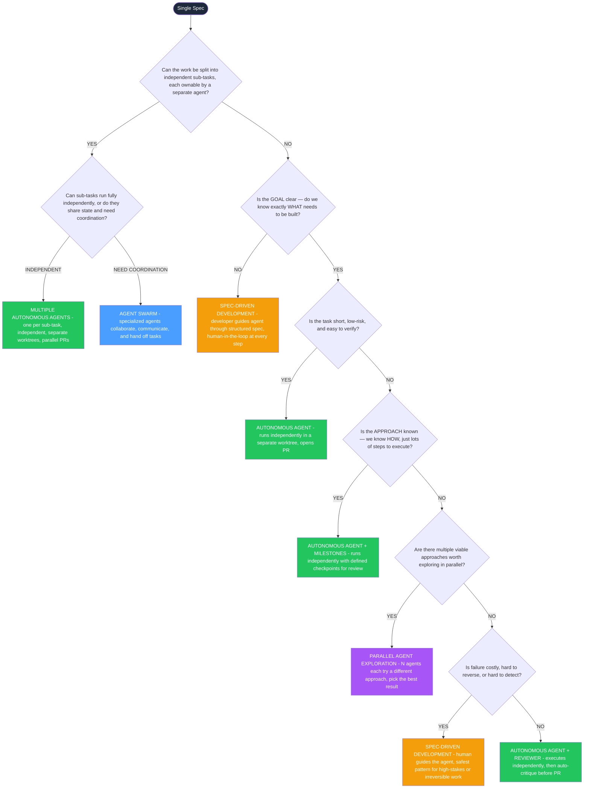

# Agent Workflow Decision Diagram

```mermaid
flowchart TD
    INPUT([Single Spec]) --> Q0

    Q0{"Can the work be split into independent sub-tasks, each ownable by a separate agent?"}
    Q0 -->|YES| Q0A
    Q0 -->|NO| Q1

    Q0A{"Can sub-tasks run fully independently, or do they share state and need coordination?"}
    Q0A -->|INDEPENDENT| OUT_MAA["MULTIPLE AUTONOMOUS AGENTS - one per sub-task, independent, separate worktrees, parallel PRs"]
    Q0A -->|NEED COORDINATION| OUT_TEAM["AGENT SWARM - specialized agents collaborate, communicate, and hand off tasks"]

    Q1{"Is the GOAL clear — do we know exactly WHAT needs to be built?"}
    Q1 -->|NO| OUT_GUIDED1["SPEC-DRIVEN DEVELOPMENT - developer guides agent through structured spec, human-in-the-loop at every step"]
    Q1 -->|YES| Q2

    Q2{"Is the task short, low-risk, and easy to verify?"}
    Q2 -->|YES| OUT_AUTO["AUTONOMOUS AGENT - runs independently in a separate worktree, opens PR"]
    Q2 -->|NO| Q3

    Q3{"Is the APPROACH known — we know HOW, just lots of steps to execute?"}
    Q3 -->|YES| OUT_MILE["AUTONOMOUS AGENT + MILESTONES - runs independently with defined checkpoints for review"]
    Q3 -->|NO| Q4

    Q4{"Are there multiple viable approaches worth exploring in parallel?"}
    Q4 -->|YES| OUT_SWARM["PARALLEL AGENT EXPLORATION - N agents each try a different approach, pick the best result"]
    Q4 -->|NO| Q5

    Q5{"Is failure costly, hard to reverse, or hard to detect?"}
    Q5 -->|YES| OUT_GUIDED2["SPEC-DRIVEN DEVELOPMENT - human guides the agent, safest pattern for high-stakes or irreversible work"]
    Q5 -->|NO| OUT_REV["AUTONOMOUS AGENT + REVIEWER - executes independently, then auto-critique before PR"]

    style OUT_MAA fill:#22c55e,color:#fff
    style OUT_TEAM fill:#4a9eff,color:#fff
    style OUT_AUTO fill:#22c55e,color:#fff
    style OUT_GUIDED1 fill:#f59e0b,color:#fff
    style OUT_MILE fill:#22c55e,color:#fff
    style OUT_SWARM fill:#a855f7,color:#fff
    style OUT_REV fill:#22c55e,color:#fff
    style OUT_GUIDED2 fill:#f59e0b,color:#fff
    style INPUT fill:#1e293b,color:#fff
```
